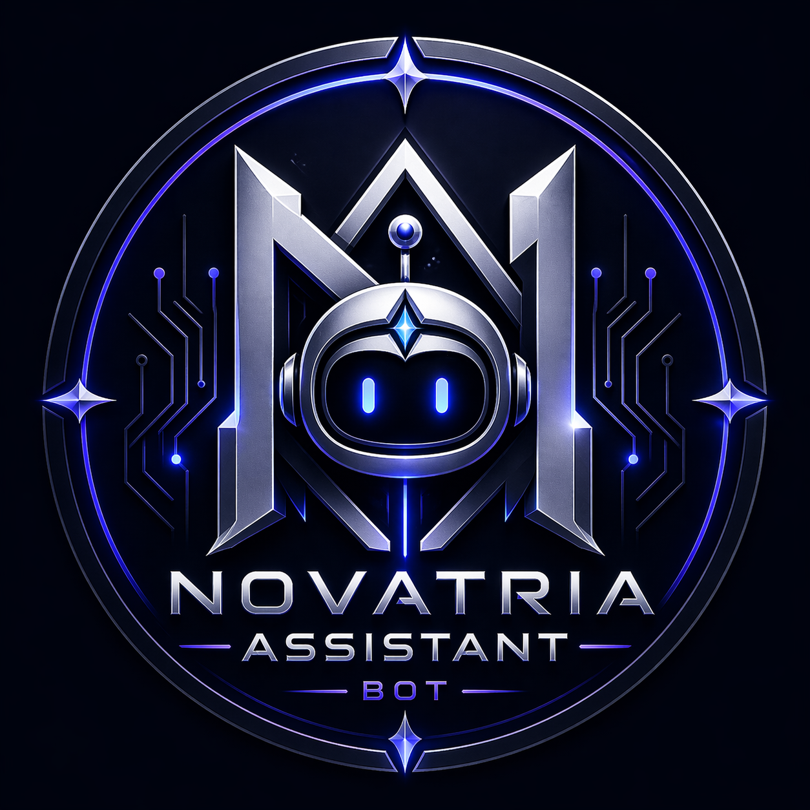

<p align="center">
  
</p>

# Novatria Assistant Bot

[](https://nodejs.org/)
[](https://discord.js.org/)
[](LICENSE)
[](https://github.com/SatriaDivo/Novatria-Assistan-Bot/actions/workflows/ci.yml)
[](#)

Novatria Assistant Bot adalah Discord bot berbasis Node.js dan discord.js v14 untuk mencatat catatan, todo, link penting, jadwal, mabar, dan arsip ke channel Discord sekaligus menyimpan datanya ke Google Sheet melalui Google Apps Script Web App.

## Features

### 🤖 Umum

| Command | Deskripsi |
|---------|-----------|
| `/ping` | Cek apakah bot aktif |
| `/help` | Lihat daftar semua command |
| `/status` | Cek channel target, permission bot, dan konfigurasi Google Sheet |
| `/list tipe limit` | Lihat data terbaru beserta ID (untuk keperluan hapus) |
| `/hapus tipe id` | Hapus data dari Google Sheet berdasarkan ID |

### 📝 Produktivitas & Catatan

| Command | Deskripsi |
|---------|-----------|
| `/catat isi` | Kirim catatan ke channel catatan → sheet `Catatan` |
| `/todo tugas` | Kirim todo ke channel todo-list → sheet `Todo` |
| `/link url judul catatan` | Kirim link penting → sheet `Link` |
| `/jadwal judul jam ...` | Kirim jadwal → sheet `Jadwal`. Opsi `tanggal`, `bulan`, `tahun`, `selesai`, `catatan` bersifat opsional |
| `/mabar game jam ...` | Kirim jadwal mabar ke channel info-mabar → sheet `Mabar`. Opsi `tanggal`, `bulan`, `tahun`, `catatan` bersifat opsional |
| `/arsip isi` | Kirim arsip → sheet `Arsip` |

### 🏴 CTF

| Command | Deskripsi |
|---------|-----------|
| `/ctfevent limit` | Lihat lomba CTF upcoming dari CTFtime public API |
| `/ctfcek` | Kirim daftar lomba CTF upcoming ke channel ctf-info |
| `/ctfnotify status` | Aktifkan/matikan notifikasi otomatis CTFtime (cek setiap 6 jam) |
| `/ctf nama platform url kategori catatan` | Tambah challenge CTF ke channel ctf-target |
| `/tantangan url judul hadiah` | Tambah tantangan dari GitHub — auto-baca file `.md` & download file ke ctf-info. Opsi `judul` dan `hadiah` opsional |
| `/writeup judul challenge ringkasan url` | Simpan writeup CTF ke channel ctf-writeup |
| `/progress challenge status catatan` | Update progress challenge CTF ke channel ctf-progress |

### ⚙️ Integrasi & Sistem

- **Google Sheet** — semua data command tersimpan otomatis via Google Apps Script Web App.
- **Google Calendar** — event jadwal otomatis dibuat di Google Calendar.
- **Auto-log** — setiap aktivitas command dicatat ke channel `log-aktivitas` atau `CHANNEL_LOG_ID`.
- **Embed message** — tampilan command rapi menggunakan Discord embed.
- **CTF Channel Guard** — di area CTF, hanya command CTF yang diizinkan; command umum ditolak otomatis.

## Struktur Folder

```text
Novatria-Bot
├─ .env.example
├─ .gitignore
├─ google-apps-script.js
├─ package.json
├─ index.js
├─ data
│  └─ .gitkeep
└─ src
   ├─ config.js
   ├─ commands
   │  ├─ definitions.js
   │  ├─ ping.js
   │  ├─ help.js
   │  ├─ status.js
   │  ├─ list.js
   │  ├─ hapus.js
   │  ├─ catat.js
   │  ├─ todo.js
   │  ├─ link.js
   │  ├─ jadwal.js
   │  ├─ mabar.js
   │  ├─ arsip.js
   │  ├─ ctfevent.js
   │  ├─ ctfcek.js
   │  ├─ ctfnotify.js
   │  ├─ ctf.js
   │  ├─ tantangan.js
   │  ├─ writeup.js
   │  └─ progress.js
   ├─ handlers
   │  └─ interactionCreate.js
   └─ utils
      ├─ ctfChannelGuard.js
      ├─ ctfChannels.js
      ├─ ctftimeApi.js
      ├─ ctftimeNotifier.js
      ├─ githubFetcher.js
      ├─ cariChannel.js
      ├─ getMabarChannel.js
      ├─ getTargetChannel.js
      ├─ kirimKeChannel.js
      ├─ logActivity.js
      ├─ buatId.js
      └─ sheet.js
```

## Instalasi

```bash
npm init -y
npm install discord.js dotenv
```

Jika dependency sudah ada dari repository, cukup jalankan:

```bash
npm install
```

## Konfigurasi Environment

Salin `.env.example` menjadi `.env`, lalu isi nilainya.

```env
TOKEN=ISI_TOKEN_BOT
CLIENT_ID=1497290662196936744
SHEET_WEBAPP_URL=ISI_URL_WEB_APP_GOOGLE_SCRIPT
SHEET_SECRET=ISI_SECRET_YANG_SAMA_DENGAN_APPS_SCRIPT
CHANNEL_CATATAN_ID=
CHANNEL_TODO_ID=
CHANNEL_LINK_ID=
CHANNEL_JADWAL_ID=
CHANNEL_MABAR_ID=
CHANNEL_ARSIP_ID=
CHANNEL_LOG_ID=

# Opsional: GitHub Personal Access Token untuk /tantangan (menghindari rate limit)
GITHUB_TOKEN=
```

Catatan:

- Jangan commit file `.env`.
- `TOKEN` adalah token bot dari Discord Developer Portal.
- `SHEET_WEBAPP_URL` adalah URL deploy Google Apps Script Web App.
- `SHEET_SECRET` harus sama dengan Script Property `SECRET_KEY` di Google Apps Script.
- Channel ID bersifat opsional. Jika kosong, bot akan mencari channel berdasarkan nama, misalnya `catatan`, `todo-list`, `link-penting`, `jadwal`, `mabar`, dan `arsip`.
- Untuk `/mabar`, bot memprioritaskan channel yang namanya mengandung `info-mabar`. Jika tidak ada, bot memakai `CHANNEL_MABAR_ID`, lalu fallback ke `jadwal-mabar`, `mabar-chat`, atau `jadwal`.

## Menjalankan Bot

```bash
node index.js
```

Atau:

```bash
npm start
```

Saat bot aktif, slash commands akan didaftarkan otomatis ke server tempat bot berada.

## Fitur CTF

Buat category CTF di Discord, lalu siapkan channel berikut:

```text
🧩 CTF
├─ 🧩-ctf-info
├─ 🤖-ctf-command
├─ 🎯-ctf-target
├─ 📝-ctf-writeup
├─ 🔗-ctf-link
├─ 🧠-ctf-notes
└─ 🏆-ctf-progress
```

Command CTF bisa dipakai di channel yang namanya mengandung `ctf-command`, misalnya `🤖-ctf-command`. Command CTF juga boleh dipakai di channel/category bot command pribadi, misalnya channel `bot-command` atau category yang namanya mengandung `bot`.

Di channel/category CTF, bot juga menolak command non-CTF seperti `/catat`, `/todo`, `/jadwal`, dan command umum lain. Jadi area CTF tetap bersih untuk workflow CTF.

Data lomba diambil dari CTFtime public API, bukan scraping web dan tidak membutuhkan cookie/login CTFtime.

### CTF Zone

`🧩 CTF ZONE — NOVATRIA HQ`

Channel ini khusus untuk belajar, tracking, dan dokumentasi CTF.

Gunakan area CTF ini untuk:

- Info lomba CTF.
- Target/challenge yang sedang dikerjakan.
- Writeup dan pembahasan.
- Link platform CTF.
- Notes command, payload, tools, dan hint.
- Progress belajar.

Rules CTF:

- Hanya untuk platform CTF resmi, lab pribadi, dan target yang memang diizinkan.
- Jangan menyerang website/server nyata tanpa izin.
- Jangan share token, password, cookie, atau data sensitif.
- Simpan catatan dan writeup dengan rapi.
- Fokus belajar, latihan, dan dokumentasi.

### Membatasi Slash Menu Di Category CTF

Discord tidak mengizinkan bot token biasa mengubah visibilitas command per channel secara otomatis. Agar slash menu di category CTF benar-benar hanya menampilkan command CTF, atur dari Discord:

1. Buka **Server Settings**.
2. Pilih **Integrations**.
3. Pilih aplikasi **Novatria Assistant** lalu klik **Manage**.
4. Untuk channel/category CTF, nonaktifkan command non-CTF:
   `/ping`, `/help`, `/status`, `/list`, `/hapus`, `/catat`, `/todo`, `/link`, `/jadwal`, `/mabar`, `/arsip`.
5. Biarkan command CTF aktif:
   `/ctfevent`, `/ctfcek`, `/ctfnotify`, `/ctf`, `/tantangan`, `/writeup`, `/progress`.

Kalau pengaturan visibility belum dilakukan di Discord, command non-CTF mungkin masih terlihat di slash menu, tetapi bot tetap akan menolaknya saat dipakai di area CTF.

### Command CTF

```text
/ctfevent limit: 5
```

Menampilkan lomba CTF upcoming dari sekarang sampai 30 hari ke depan. Opsi `limit` bersifat opsional, default `5`, minimal `1`, maksimal `10`. Tanggal ditampilkan dalam timezone Asia/Jakarta/WIB.

```text
/ctfcek
```

Mengirim embed daftar lomba CTF upcoming ke channel tujuan. Bot mencari channel tujuan dengan prioritas nama `ctf-info`, lalu `ctf-lomba`, lalu channel yang mengandung `ctf`.

```text
/ctfnotify status: on
/ctfnotify status: off
```

Mengaktifkan atau mematikan notifikasi otomatis CTFtime. Saat aktif, bot mengecek event CTFtime setiap 6 jam dan mengirim event baru ke channel CTF tanpa mengirim ulang event yang sama.

Status notifikasi disimpan di `data/ctftime-settings.json`. Event yang sudah pernah dikirim disimpan di `data/ctftime-seen.json`. File JSON ini dibuat otomatis saat bot berjalan dan tidak perlu dicommit.

```text
/ctf nama: SQL Injection Lab platform: TryHackMe url: https://example.com kategori: web catatan: Fokus basic auth bypass
```

Menambahkan challenge CTF ke channel `🎯-ctf-target` dan menyimpannya sebagai `ctf_challenge` jika Google Sheet aktif.

```text
/writeup judul: SQL Injection Lab challenge: SQL Injection Lab ringkasan: Payload utama dan langkah exploit url: https://example.com/writeup
```

Menyimpan writeup ke channel `📝-ctf-writeup` dan menyimpannya sebagai `ctf_writeup` jika Google Sheet aktif.

```text
/progress challenge: SQL Injection Lab status: Sedang dikerjakan catatan: Sudah dapat endpoint login
```

Mengirim update progress ke channel `🏆-ctf-progress` dan menyimpannya sebagai `ctf_progress` jika Google Sheet aktif.

```text
/tantangan url: https://github.com/user/ctf-challenges/tree/main/web/sqli-basic judul: SQL Injection Basic hadiah: Rp500.000
```

Menambahkan tantangan dari GitHub ke channel `🧩-ctf-info`. Bot otomatis membaca file `.md` dan menampilkannya sebagai embed, serta mengirim file lainnya sebagai attachment. Opsi `judul` dan `hadiah` bersifat opsional.

## Menjalankan Dengan Docker di Windows

Pastikan Docker Desktop sudah terinstall dan berjalan. File `.env` tetap dipakai dari folder project dan tidak dimasukkan ke image Docker.

Build dan jalankan bot:

```bash
docker compose up -d --build
```

Lihat log bot:

```bash
docker compose logs -f
```

Restart bot:

```bash
docker compose restart
```

Stop bot:

```bash
docker compose down
```

Container memakai `restart: unless-stopped`, jadi Docker akan menjalankan ulang bot otomatis setelah Docker Desktop aktif kembali.

### Auto Run Saat Laptop Menyala

Cara paling mudah di Windows:

1. Buka Docker Desktop.
2. Masuk **Settings**.
3. Aktifkan **Start Docker Desktop when you sign in**.
4. Jalankan sekali:

```bash
docker compose up -d --build
```

Setelah itu, saat laptop menyala dan kamu login Windows, Docker Desktop akan start dan container `novatria-bot` akan hidup lagi otomatis.

Repository ini menyediakan script Startup Folder untuk auto-run tanpa admin:

```powershell
powershell -ExecutionPolicy Bypass -File .\scripts\install-startup-folder.ps1
```

Untuk menghapus auto-run dari Startup Folder:

```powershell
powershell -ExecutionPolicy Bypass -File .\scripts\uninstall-startup-folder.ps1
```

## Permission Discord

Pastikan bot punya permission berikut pada channel target:

- View Channel
- Send Messages
- Use Application Commands

Gunakan `/status` untuk mengecek apakah channel dan permission sudah benar.

## Google Apps Script

Bot mengirim data ke Google Sheet melalui POST request ke `SHEET_WEBAPP_URL`.

Payload yang dikirim:

```json
{
  "secret": "isi-secret-anda",
  "action": "append",
  "type": "catat",
  "data": {
    "id": "CAT-MABC1234-ABCD",
    "user": "username#0000",
    "userId": "123",
    "server": "Novatria HQ",
    "channel": "catatan",
    "isi": "contoh catatan"
  }
}
```

Pastikan Apps Script:

- Memiliki fungsi `doPost(e)`.
- Memvalidasi `secret` dari Script Property `SECRET_KEY`.
- Menyimpan, membaca, dan menghapus data berdasarkan `type`.
- Dideploy sebagai Web App.

Kode lengkap Apps Script tersedia di `google-apps-script.js`. Apps Script mendukung sheet `Catatan`, `Todo`, `Link`, `Jadwal`, `Mabar`, `Arsip`, dan `Log`. Jika memakai fitur `/status`, `/list`, `/hapus`, dan `/mabar`, paste ulang isi file itu ke Google Apps Script lalu deploy versi Web App terbaru.

### Setup Script Properties

Di Google Apps Script, buka **Project Settings** lalu tambahkan Script Properties berikut:

```text
SECRET_KEY=isi-secret-anda
SPREADSHEET_ID=id-google-sheet-anda
```

Nilai `SECRET_KEY` harus sama dengan `SHEET_SECRET` di `.env`. Setelah mengubah Script Properties atau kode Apps Script, deploy ulang sebagai **New version**.

## Command Contoh

```text
/ping
/help
/status
/list tipe: Todo limit: 10
/hapus tipe: Todo id: TODO-MABC1234-ABCD
/catat isi: test catatan
/todo tugas: belajar discord bot
/link url: https://example.com judul: Contoh catatan: testing link
/jadwal judul: Meeting jam: 20:00 selesai: 21:00 catatan: bahas bot hari ini
/jadwal judul: Meeting jam: 20:00 tanggal: 25 bulan: 4 tahun: 2026 selesai: 21:00 catatan: bahas bot
/mabar game: Mobile Legends jam: 20:00 catatan: push rank hari ini
/mabar game: Mobile Legends tanggal: 30 bulan: 4 tahun: 2026 jam: 20:00 catatan: push rank
/arsip isi: dokumen penting testing
/ctfevent limit: 5
/ctfcek
/ctfnotify status: on
/ctf nama: SQL Injection Lab platform: TryHackMe kategori: web catatan: latihan auth bypass
/tantangan url: https://github.com/user/ctf-challenges/tree/main/web/sqli judul: SQL Injection hadiah: Sertifikat
/writeup judul: SQL Injection Lab challenge: SQL Injection Lab ringkasan: payload dan step exploit
/progress challenge: SQL Injection Lab status: Sedang dikerjakan catatan: sudah dapat hint pertama
```

## Catatan Keamanan

Jika token bot pernah terlihat di terminal, chat, atau commit, segera regenerate token dari Discord Developer Portal dan perbarui `.env`.
